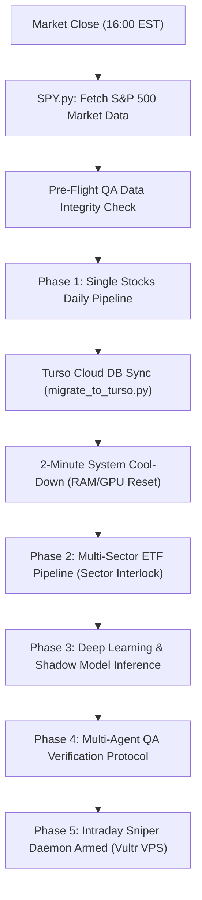
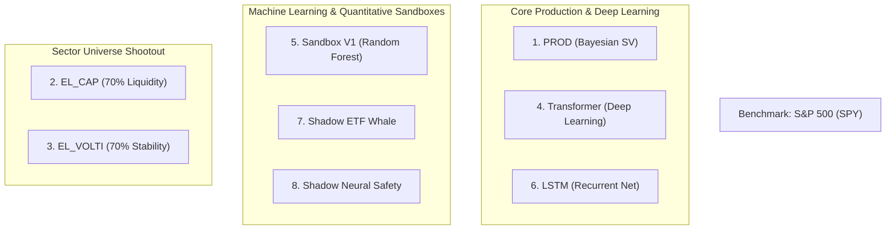

# 🏛️ The Oracle & AntiGravity: Master Architecture & AI Engineering Reference

This document is the definitive technical manual for **The Oracle / AntiGravity** quantitative trading system. It details the end-to-end data pipeline, the mathematical interlock between Single Stocks and ETFs, and the complete mathematical formulas, priors, and hyperparameter specifications for all 8 models in the Arena.

---

## 1. 🔄 Master Daily Execution Pipeline

The master pipeline runs daily post-market close (`16:00 EST / 23:00 Israel IDT`) and is orchestrated by `master_pipeline.py` and `laptop_catchup_controller.py`:

---

## 2. 📈 Phase 1: Single Stock Daily Flow

1. **Market Ingestion (`data_loader.py` & `failover_downloader.py`):**
   * Pulls raw OHLCV prices for candidate S&P 500 equities from Yahoo Finance with automated Tiingo REST API failover.
   * Generates technical feature set:
     * **RSI (14-day)**
     * **MACD Signal Line & Histogram**
     * **Stochastic Volatility / True Range**
     * **Volume Moving Average Ratio:** $\text{VolRatio}_d = \frac{\text{Volume}_t}{\text{MA}_{30}(\text{Volume})}$
     * **Analyst Consensus & Upside Delta**
2. **Causal Lead-Lag Chain Construction:**
   * Computes volume-weighted lagged predictors across horizons ($t-1, t-2, t-3$):
     $$\text{Feature}_d = \text{Return}_{t-d} \times \text{VolRatio}_{t-d}$$
3. **MCMC Bayesian Inference (`export_bayesian_scorecard_formatted.py`):**
   * Executes dual-headed Bayesian Generalized Linear Model (GLM) for each equity to derive:
     1. Directional win probability $P(\text{UP})$.
     2. Expected return magnitude $\mu_{\text{mag}}$.
4. **Virtual Broker Allocation (`virtual_broker.py`):**
   * Uses **Half-Kelly Capital Sizing**:
     $$f^* = 0.5 \times \frac{p \cdot b - q}{b}$$
   * Allocates across 4 stock personas:
     * **BallsForBrains:** High-conviction, top alpha, concentrated allocation.
     * **Dynamic:** Medium-high conviction with volatility clipping.
     * **Neutral:** Balanced multi-asset hedge.
     * **Conservative:** Capital preservation mode (switches to 100% Cash when market fear is elevated).
5. **Database Persistence:**
   * Writes daily mark-to-market balances to `capital_ledgers` and pre-market orders to `pending_orders` in Turso Cloud DB.

---

## 3. 🌉 The Interlock: What Passes from Single Stocks $\to$ ETFs?

The Multi-Sector ETF engine leverages bottom-up single stock intelligence to construct macro sector regimes:

1. **Bottom-Up Sector Momentum Score:**
   * For each S&P 500 sector, the system computes the weighted mean Bayesian win probability and expected return of its constituent equities:
     $$\text{SectorScore}_k = \frac{1}{N_k} \sum_{i \in \text{Sector}_k} P(\text{UP})_i \times \text{ExpectedReturn}_i$$
2. **Macro Sector Regime Flags (`SEC_REG` & `SEC_MOM`):**
   * Passed to the ETF feature matrix:
     * `BULL_REGIME` ($+1$) if sector momentum is positive and S&P 500 is above its 20-day EMA.
     * `BEAR_REGIME` ($-1$) if sector momentum is decaying.
3. **Dynamic Target Selection (`generate_dynamic_etfs.py`):**
   * Filters the 11 Select Sector SPDR ETFs plus leveraged instruments (`UDOW`, `MSTZ`, `IWD`).
   * Saves the top 8 candidates to `Dynamic_Target_ETFs.json` for ETF pipeline scoring.

---

## 4. 📊 Phase 2: Multi-Sector ETF Daily Flow

1. **ETF Hybrid Matrix Builder (`build_etf_hybrid_matrix.py`):**
   * Merges ETF price data with the sector momentum scores passed from the stock layer.
2. **Parallel Bayesian Scoring (`export_etf_scorecard.py`):**
   * Spawns 3 parallel worker threads via Rust-accelerated NUTS sampler (`nutpie`).
3. **ETF Virtual Broker (`etf_virtual_broker.py`):**
   * Calculates target allocations across 4 ETF personas (`ETF_BallsForBrains`, `ETF_Dynamic`, `ETF_Neutral`, `ETF_Conservative`).
   * Writes staged BUY/HOLD orders to `pending_orders`.

---

## 5. ⚔️ The Arena: Comprehensive Model Specifications

All 8 models compete head-to-head starting from an identical normalized balance of **\$10,000.00**:

---

### 1️⃣ Model 1: PROD (`PROD_Bayesian_SV` / `BallsForBrains`)
* **Core Paradigm:** Full Bayesian Stochastic Volatility MCMC with Rust NUTS inference.
* **Objective:** Predicts directional win probability $P(\text{UP})$ and expected return magnitude while dynamically accounting for latent time-varying market volatility.
* **Priors & Initial Parameters:**
  * **Vol Step Size:** $\sigma_{\text{step}} \sim \text{Exponential}(10.0)$
  * **Latent Volatility Path:** $h_t \sim \text{GaussianRandomWalk}(\sigma = \sigma_{\text{step}})$
  * **Student-t Degrees of Freedom:** $\nu \sim \text{Exponential}(0.1)$
  * **Direction Intercept:** $\alpha_{\text{dir}} \sim \text{Normal}(\mu = \text{FundamentalScore}, \sigma = 1.0)$
  * **Feature Coefficients:** $\beta_{\text{dir}} \sim \text{Normal}(\mu = \mu_{\beta, \text{MetaPriors}}, \sigma = 0.5)$
* **Sampling Engine:** Rust-compiled `nutpie` NUTS Sampler (2 chains, 1000 draws, 1000 tune, target accept = 0.90).
* **Capital Sizing:** Half-Kelly Criterion ($f^* = 0.5 \times \frac{p \cdot b - q}{b}$).

---

### 2️⃣ Model 2: EL_CAP (Olympic Universe: 70% Liquidity / 30% Stability)
* **Core Paradigm:** Institutional Capital Flow Universe.
* **Universe Selection Formula:**
  $$\text{Score}_{\text{EL\_CAP}} = 0.70 \times \text{Norm}(\text{Average Dollar Liquidity}) + 0.30 \times \left(1 - \text{Norm}(\text{Volatility})\right)$$
  * *Liquidity Metric:* $\text{MA}_{30}(\text{Close} \times \text{Volume})$
  * *Norm Function:* Min-Max scaling per GICS sector.
* **Execution:** Trades top-scoring large-cap equities with highest institutional participation.

---

### 3️⃣ Model 3: EL_VOLTI (Olympic Universe: 70% Stability / 30% Liquidity)
* **Core Paradigm:** Low-Beta Capital Preservation Universe.
* **Universe Selection Formula:**
  $$\text{Score}_{\text{EL\_VOLTI}} = 0.30 \times \text{Norm}(\text{Average Dollar Liquidity}) + 0.70 \times \left(1 - \text{Norm}(\text{Volatility})\right)$$
* **Execution:** Selects maximum stability equities with low annualized variance, shielding capital during high-VIX market pullbacks.

---

### 4️⃣ Model 4: Shadow Transformer (`Shadow_Transformer`)
* **Core Paradigm:** Multi-Head Self-Attention Deep Learning Network.
* **Architecture & Layers:**
  * **Input Sequence:** 30-day lookback window across 24 normalized technical & causal features.
  * **Embedding Dimension:** $d_{\text{model}} = 64$.
  * **Attention Heads:** 4 parallel attention heads.
  * **Feed-Forward Dimension:** $d_{\text{ff}} = 128$.
  * **Dropout:** $0.15$ with Layer Normalization.
* **Loss Function:** Binary Cross-Entropy with Focal Loss ($\gamma = 2.0$) to penalize false breakout predictions.
* **Initialization / Optimizer:** Xavier Uniform initialization, AdamW optimizer ($\text{lr} = 10^{-4}$, weight decay = $10^{-2}$).

---

### 5️⃣ Model 5: Sandbox V1 Classic (`Sandbox_V1`)
* **Core Paradigm:** Ensemble Machine Learning (Classic Baseline).
* **Architecture:** Random Forest Classifier (100 Decision Trees).
* **Hyperparameters:**
  * `max_depth = 4`
  * `min_samples_split = 10`
  * `max_features = 'sqrt'`
  * `criterion = 'gini'`
* **Execution:** Evaluates multi-period RSI/MACD cross momentum with strict unleveraged allocation.

---

### 6️⃣ Model 6: Shadow LSTM (`Shadow_LSTM`)
* **Core Paradigm:** Recurrent Neural Network with Long Short-Term Memory cells.
* **Architecture & Layers:**
  * **Input Sequence:** 20-day historical sequence.
  * **LSTM Layers:** 2 stacked Bidirectional LSTM layers (64 hidden units each).
  * **Dense Output Layer:** Fully connected sigmoid head.
* **Regularization:** L2 weight decay ($10^{-4}$) and recurrent dropout ($0.20$).
* **Optimizer:** RMSprop with gradient clipping ($\text{clipnorm} = 1.0$).

---

### 7️⃣ Model 7: Shadow ETF Whale (`Shadow_ETF_Whale`)
* **Core Paradigm:** Institutional Macro Rotation.
* **Execution Logic:**
  * Monitors daily institutional volume flow into the 11 Select Sector SPDR ETFs.
  * Allocates capital to the top 2 sectors exhibiting positive cumulative volume delta while maintaining an inverse-volatility cash cushion.

---

### 8️⃣ Model 8: Shadow Neural Safety (`Shadow_Neural_Safety`)
* **Core Paradigm:** Volatility-Adaptive Capital Preservation Engine.
* **Dynamic Safety Multiplier:**
  $$\text{Safety Multiplier} = \max\left(0.50, \, 1.0 - \max(0.0, \, (\text{VIX} - 15.0) \times 0.05)\right)$$
* **Execution:** Dynamically scales equity exposure and tightens trailing stops based on real-time implied volatility regimes.

---

## 📊 Summary Comparison Matrix

| Model Name | Type | Key Engine | Primary Metric / Signal | Risk Sizing |
| :--- | :--- | :--- | :--- | :--- |
| **1. PROD (BallsForBrains)** | Bayesian MCMC | PyMC / Rust NUTS | $P(\text{UP}) \ge 55\%$ & Volatility GRW | Half-Kelly |
| **2. EL_CAP** | Quantitative | Sector Matrix | 70% Liquidity / 30% Low-Vol | Static Weight |
| **3. EL_VOLTI** | Quantitative | Sector Matrix | 70% Low-Vol / 30% Liquidity | Minimum Variance |
| **4. Transformer** | Deep Learning | Multi-Head Attention | Focal Cross-Entropy Direction | Softmax Confidence |
| **5. Sandbox V1** | Machine Learning | Random Forest | Gini Impurity Tree Split | Fixed Percentage |
| **6. LSTM** | Deep Learning | Bi-Directional LSTM | Recurrent Temporal Sequence | Linear Probability |
| **7. ETF Whale** | Macro Factor | Flow Analysis | Sector Volume Inflow Delta | Inverse-Vol Sizing |
| **8. Neural Safety** | Regime Adaptive | Neural Network | VIX Dynamic Multiplier | Volatility Scaling |

---

## 🛡️ Intraday Execution Daemon Protocol (`ag-sniper.service`)

* **Execution Host:** Vultr Cloud VPS (`66.42.118.26`).
* **Tick Polling:** Evaluates real-time prices every 30 seconds against previous close.
* **Sensors:**
  * **Limit Entry:** Executes staged orders on pre-market intraday pullbacks.
  * **Take-Profit Trigger:** Automatically locks profits at $+4.0\%$ (unleveraged) / $+8.0\%$ (leveraged).
  * **Dynamic Stop-Loss:** Liquidates position if loss exceeds $-4.0\%$.
* **EOD Settlement:** Computes closing mark-to-market balances and updates Turso Cloud DB `capital_ledgers`.
